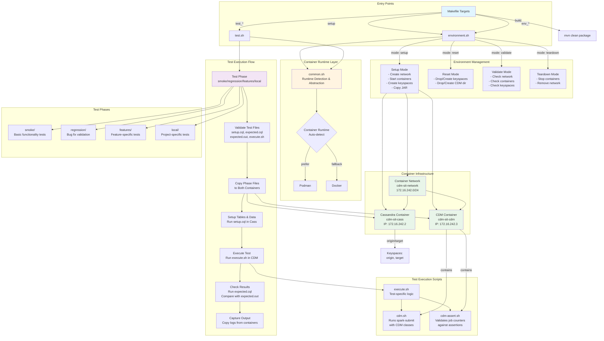

# SIT (System Integration Testing) Architecture

## Overview

The SIT framework provides automated integration testing for the Cassandra Data Migrator (CDM) using containerized environments. It supports both Docker and Podman runtimes with automatic detection.

## Architecture Diagram



## Component Details

### Core Scripts

#### 1. **Makefile**
- **Purpose**: Orchestrates build, setup, and test execution
- **Key Targets**:
  - `all`: Complete test suite (setup → smoke → regression → features → teardown)
  - `setup`: Build project + environment setup
  - `test_smoke/regression/features`: Run specific test phases
  - `env_setup/reset/validate/teardown`: Environment management
  - `setup_podman/docker`: Explicit runtime selection

#### 2. **common.sh**
- **Purpose**: Container runtime abstraction layer
- **Features**:
  - Auto-detects Podman (preferred) or Docker
  - Provides unified wrapper functions for container operations
  - Exports environment variables (container names, credentials, paths)
  - Logging utilities (_info, _warn, _error, _fatal)

#### 3. **environment.sh**
- **Purpose**: Manages containerized test environment
- **Modes**:
  - **setup**: Creates network, starts containers, creates keyspaces, copies JAR
  - **reset**: Drops/recreates keyspaces and CDM directory (keeps containers running)
  - **validate**: Checks environment health
  - **teardown**: Stops containers and removes network
- **Infrastructure**:
  - Network: `cdm-sit-network` (172.16.242.0/24)
  - Cassandra: `cdm-sit-cass` (172.16.242.2)
  - CDM: `cdm-sit-cdm` (172.16.242.3)
  - Keyspaces: `origin`, `target`

#### 4. **test.sh**
- **Purpose**: Executes test phases
- **Flow**:
  1. Validates required files in test directories
  2. Cleans previous test outputs
  3. Copies test files to both containers
  4. Runs `setup.cql` in Cassandra container (creates tables/data)
  5. Executes `execute.sh` in CDM container (runs migration/validation)
  6. Runs `expected.cql` in Cassandra container (queries results)
  7. Compares actual output with `expected.out`
  8. Captures all logs and outputs

#### 5. **cdm.sh**
- **Purpose**: Executes CDM jobs via spark-submit
- **Input**: Config file with scenario definitions
  ```
  scenario_name  CDM_class_name  properties_file_path
  ```
- **Output**: `cdm.{scenario}.out` and `cdm.{scenario}.err`
- **Execution**: Runs Spark job with CDM classes (Migrate, DiffData, etc.)

#### 6. **cdm-assert.sh**
- **Purpose**: Validates CDM job execution results
- **Process**:
  - Extracts "Final" job counter summary from output
  - Compares against expected assertion file
  - Reports differences if validation fails

## Test Structure

Each test directory must contain:
- **setup.cql**: Creates tables and initial data
- **expected.cql**: Queries to generate actual results
- **expected.out**: Expected query results
- **execute.sh**: Test execution logic (calls cdm.sh, cdm-assert.sh)
- **{scenario}.properties**: CDM configuration files
- **cdm.{scenario}.assert**: Expected job counter values (optional)

## Test Phases

### 1. **smoke/**
Basic functionality tests validating core CDM operations

### 2. **regression/**
Tests ensuring previously fixed bugs remain fixed

### 3. **features/**
Feature-specific tests for advanced CDM capabilities

### 4. **local/**
Project-specific tests (not included in automated CI)

## Usage Examples

### Default (auto-detect runtime engine, Podman preferred)
```bash
make setup
make test
```

### Explicit Podman
```bash
CONTAINER_RUNTIME=podman make setup
make test_podman
```

### Explicit Docker
```bash
CONTAINER_RUNTIME=docker make setup
make test_docker
```

### Script-level
```bash
./environment.sh -m setup -j ../target/cassandra-data-migrator*.jar -r podman
```

### Individual Test Phases
```bash
make test_smoke      # Smoke tests only
make test_regression # Regression tests only
make test_features   # Feature tests only
```

### Environment Management
```bash
make env_setup      # Setup environment
make env_reset      # Reset (keep containers, recreate data)
make env_validate   # Check environment health
make env_teardown   # Teardown everything
```

## Key Design Principles

1. **Container Runtime Agnostic**: Supports both Podman and Docker with automatic detection
2. **Isolated Environment**: Each test runs in clean containerized environment
3. **Repeatable**: Reset capability allows running tests multiple times
4. **Comprehensive**: Tests cover smoke, regression, and feature scenarios
5. **Assertion-based**: Validates both data results and job execution metrics
6. **Modular**: Each test is self-contained with its own setup/validation logic

## Network Architecture

```
Host Machine
    │
    ├─── cdm-sit-network (172.16.242.0/24)
    │       │
    │       ├─── cdm-sit-cass (172.16.242.2)
    │       │    └─── Cassandra 5
    │       │         ├─── origin keyspace
    │       │         └─── target keyspace
    │       │
    │       └─── cdm-sit-cdm (172.16.242.3)
    │            └─── Spark + CDM JAR
    │                 └─── /local/cassandra-data-migrator.jar
```

## Troubleshooting

- **Container runtime not found**: Install Podman or Docker
- **Network conflicts**: Change CIDR with `-c` flag
- **Port conflicts**: Containers use internal networking only
- **Test failures**: Check `{test}/output/*.out` and `*.err` files
- **Environment issues**: Run `make env_validate` to diagnose

---
