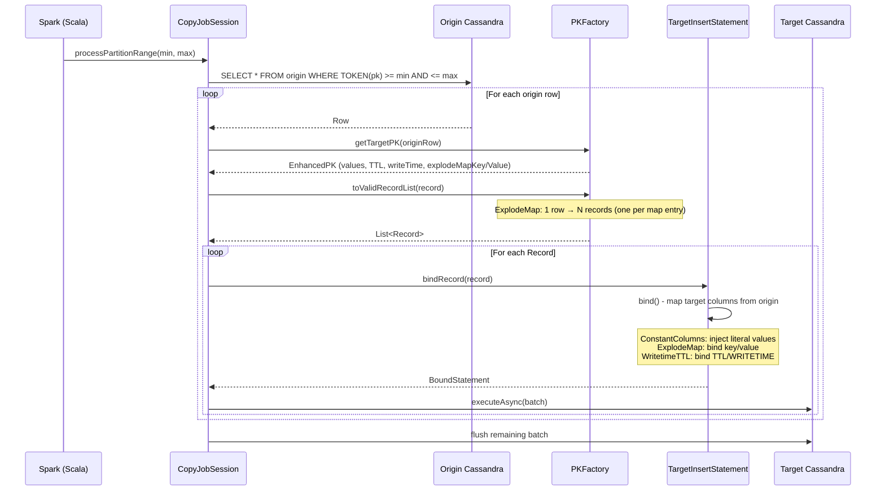
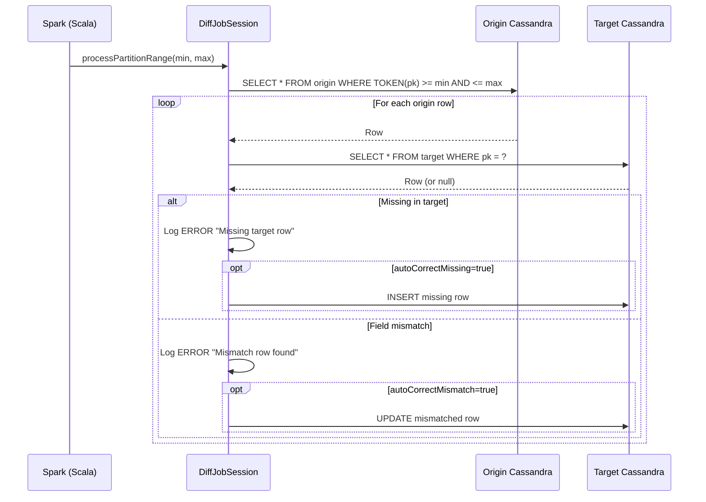

# Cassandra Data Migrator (CDM) - Architecture & Context Summary

**Version**: 5.7.4-SNAPSHOT | **Stack**: Java 11, Scala 2.13, Spark 3.5.8, Cassandra Java Driver 4.19.2
**Last Updated**: 2026-03-01 (Full architecture review + CDM Config Builder added)

---

## 1. Project Overview

CDM migrates and validates data between Cassandra clusters (including Astra DB). It runs as a Spark job submitted via `spark-submit`, parallelizing work across token-range partitions.

**Three job modes:**
| Mode | Spark Class | Factory |
|------|-------------|---------|
| Migrate | `com.datastax.cdm.job.Migrate` | `CopyJobSessionFactory` |
| Validate (Diff) | `com.datastax.cdm.job.DiffData` | `DiffJobSessionFactory` |
| Guardrail Check | `com.datastax.cdm.job.GuardrailCheck` | `GuardrailCheckJobSessionFactory` |

---

## 2. High-Level Architecture

```
┌─────────────────────────────────────────────────────────────────┐
│                        spark-submit                             │
│                  (cdm.properties config file)                   │
└──────────────────────────┬──────────────────────────────────────┘
                           │
              ┌────────────▼────────────┐
              │   Scala Entry Point     │
              │  Migrate / DiffData /   │
              │  GuardrailCheck         │
              │  (extends BasePartition │
              │   Job → BaseJob)        │
              └────────────┬────────────┘
                           │ Spark parallelize(partitionRanges)
              ┌────────────▼────────────┐
              │   Per-Partition Worker  │
              │  AbstractJobSession<T>  │
              │  ├─ CopyJobSession      │
              │  ├─ DiffJobSession      │
              │  └─ GuardrailCheck...   │
              └────────────┬────────────┘
                           │
         ┌─────────────────┼─────────────────┐
         ▼                 ▼                 ▼
   EnhancedSession   EnhancedSession    Features
   (Origin)          (Target)           (loaded from props)
   ├─ CqlTable        ├─ CqlTable        ├─ ExplodeMap
   ├─ PKFactory       ├─ PKFactory       ├─ ConstantColumns
   └─ Statements      └─ Statements      ├─ WritetimeTTL
                                         ├─ OriginFilter
                                         ├─ ExtractJson
                                         └─ Guardrail
```

---

## 3. Package Structure

```
src/main/
├── scala/com/datastax/cdm/job/
│   ├── BaseJob.scala              # Spark setup, partition range calc
│   ├── BasePartitionJob.scala     # TrackRun, partition splitting
│   ├── Migrate.scala              # Entry: JobType.MIGRATE
│   ├── DiffData.scala             # Entry: JobType.VALIDATE
│   ├── GuardrailCheck.scala       # Entry: JobType.GUARDRAIL
│   └── ConnectionFetcher.scala    # CassandraConnector factory
│
└── java/com/datastax/cdm/
    ├── job/
    │   ├── BaseJobSession.java         # Feature map init, rate limiters
    │   ├── AbstractJobSession.java     # Session wiring, PKFactory init
    │   ├── CopyJobSession.java         # Migrate: read origin → write target
    │   ├── DiffJobSession.java         # Validate: compare origin vs target
    │   ├── GuardrailCheckJobSession.java
    │   ├── PartitionRange.java         # [min,max] token range + JobCounter
    │   ├── SplitPartitions.java        # Token range splitting
    │   ├── TrackRun (feature)          # Run progress persistence
    │   └── CDMMetricsAccumulator.java  # Spark accumulator for metrics
    │
    ├── cql/
    │   ├── EnhancedSession.java        # Wraps CqlSession + CqlTable + statements
    │   ├── statement/
    │   │   ├── BaseCdmStatement.java
    │   │   ├── OriginSelectStatement.java
    │   │   ├── OriginSelectByPartitionRangeStatement.java  # TOKEN(pk) >= ? AND <= ?
    │   │   ├── OriginSelectByPKStatement.java
    │   │   ├── TargetUpsertStatement.java      # Abstract base for INSERT/UPDATE
    │   │   ├── TargetInsertStatement.java      # INSERT INTO ... VALUES (?)
    │   │   ├── TargetUpdateStatement.java      # UPDATE ... SET ... (counters)
    │   │   ├── TargetSelectByPKStatement.java
    │   │   └── TargetUpsertRunDetailsStatement.java
    │   └── codec/
    │       ├── Codecset.java           # Enum of codec pairs
    │       ├── CodecFactory.java       # Creates codec pairs by Codecset
    │       ├── TEXTMillis_InstantCodec.java   # TEXT(millis) → Instant
    │       ├── TEXTFormat_InstantCodec.java   # TEXT(format) → Instant
    │       └── ... (13 codec implementations)
    │
    ├── data/
    │   ├── Record.java             # (EnhancedPK, originRow, targetRow)
    │   ├── EnhancedPK.java         # PK values + TTL + writeTime + explodeMap
    │   ├── PKFactory.java          # Builds EnhancedPK from origin rows
    │   ├── CqlConversion.java      # Type conversion between origin/target types
    │   ├── CqlData.java            # CQL type utilities
    │   └── DataUtility.java
    │
    ├── feature/
    │   ├── Featureset.java         # Enum: ORIGIN_FILTER, CONSTANT_COLUMNS, EXPLODE_MAP, EXTRACT_JSON, WRITETIME_TTL, GUARDRAIL_CHECK
    │   ├── AbstractFeature.java    # loadProperties() + initializeAndValidate()
    │   ├── ExplodeMap.java         # MAP column → multiple rows
    │   ├── ConstantColumns.java    # Inject constant values into target
    │   ├── WritetimeTTL.java       # Preserve/transform TTL & WRITETIME
    │   ├── OriginFilterCondition.java
    │   ├── ExtractJson.java
    │   ├── Guardrail.java
    │   └── TrackRun.java           # Persist run progress to target keyspace
    │
    ├── schema/
    │   ├── BaseTable.java          # Keyspace/table name resolution
    │   └── CqlTable.java           # Full schema metadata + codec registry
    │
    └── properties/
        ├── KnownProperties.java    # All spark.cdm.* property definitions + defaults
        ├── PropertyHelper.java     # Reads Spark conf → typed values
        └── IPropertyHelper.java
```

---

## 4. Data Flow: Migration (Migrate Job)



---

## 5. Data Flow: Validation (DiffData Job)



---

## 6. Feature System

Features are loaded once per job session from properties, then applied per-row during bind.

```
BaseJobSession.calcFeatureMap()
  └── For each Featureset enum value:
        FeatureFactory.getFeature(f)
        feature.loadProperties(propertyHelper)  → isEnabled?
        → stored in featureMap: Map<Featureset, Feature>

AbstractJobSession constructor:
  └── For each feature in featureMap:
        feature.initializeAndValidate(originTable, targetTable)
        → validates column names exist, types compatible, etc.
```

### Feature: ExplodeMap
- **Property**: `spark.cdm.transform.explodeMap.origin.columnName`
- **Effect**: One origin row with a MAP column → N target rows (one per map entry)
- **Key columns**: `keyColumnName` (target PK), `valueColumnName` (target column)
- **Flow**: `PKFactory.toValidRecordList()` iterates map entries, creates one `EnhancedPK` per entry

### Feature: ConstantColumns
- **Properties**: `spark.cdm.transform.constantColumns.names`, `spark.cdm.transform.constantColumns.values`
- **Effect**: Injects literal constant values into target columns not present in origin
- **Flow**: Constants are embedded directly in the INSERT CQL (not bound), excluded from `bindColumnIndexes`

### Feature: WritetimeTTL
- **Properties**: `spark.cdm.schema.origin.column.ttl.*`, `spark.cdm.schema.origin.column.writetime.*`
- **Effect**: Preserves or transforms TTL and WRITETIME from origin to target
- **Flow**: `EnhancedPK` carries `ttl` and `writeTimestamp`; bound at end of INSERT via `USING TTL ? AND TIMESTAMP ?`

### Feature: OriginFilterCondition
- **Effect**: Appends custom WHERE clause to origin SELECT (e.g., filter by column value)
- **Flow**: Appended to `OriginSelectByPartitionRangeStatement.buildStatement()`

### Feature: ExtractJson
- **Effect**: Extracts a field from a JSON string column in origin, writes to target column
- **Flow**: Handled in `TargetInsertStatement.bind()` at the target column index

### Feature: Guardrail
- **Effect**: Checks origin data against guardrail limits (e.g., partition size, column count)
- **Flow**: `GuardrailCheckJobSession` only reads origin, no target writes

---

## 7. CQL Statement Hierarchy

```
BaseCdmStatement
├── OriginSelectStatement
│   ├── OriginSelectByPartitionRangeStatement   # TOKEN(pk) range scan
│   └── OriginSelectByPKStatement               # Point lookup by PK
└── TargetUpsertStatement (abstract)
    ├── TargetInsertStatement                   # Non-counter tables
    └── TargetUpdateStatement                   # Counter tables
```

**TargetInsertStatement.bind() logic:**
```
For each targetIndex in targetColumnTypes:
  if targetIndex NOT in bindColumnIndexes → skip (constant column)
  elif targetIndex == explodeMapKeyIndex  → bindValue = explodeMapKey
  elif targetIndex == explodeMapValueIndex → bindValue = explodeMapValue
  elif targetIndex == extractJsonFeature.targetIndex → bindValue = extractJson(originRow)
  else:
    originIndex = cqlTable.getCorrespondingIndex(targetIndex)
    if originIndex < 0 → bindValue = null (triggers unset, avoids tombstone)
    else → bindValue = getAndConvertData(originIndex, originRow)
  
  if shouldUnsetValue(bindValue) → boundStatement.unset(currentBindIndex)
  else → boundStatement.set(currentBindIndex, bindValue, bindClass)
  currentBindIndex++

if usingTTL → bind ttl at currentBindIndex++
if usingWriteTime → bind writeTime at currentBindIndex++
```

---

## 8. Type Conversion System

```
CqlTable.getAndConvertData(originIndex, originRow)
  └── CqlConversion.convert(value)
        ├── Type.NONE      → return as-is
        ├── Type.CODEC     → convert_CODEC(value)
        │     ├── if fromType == toType → standard encode/decode via ByteBuffer
        │     └── if fromType != toType → direct codec lookup (fromType, toClass)
        │           e.g., TEXTMillis_InstantCodec for TEXT→TIMESTAMP
        ├── Type.LIST/SET/MAP → recurse on elements
        └── Type.UDT       → recurse on fields
```

**Available Codec Pairs (Codecset enum):**
| Codecset | Origin Type | Target Type |
|----------|-------------|-------------|
| INT_STRING | INT | TEXT |
| DOUBLE_STRING | DOUBLE | TEXT |
| BIGINT_STRING | BIGINT | TEXT |
| BIGINT_BIGINTEGER | BIGINT | BigInteger |
| DECIMAL_STRING | DECIMAL | TEXT |
| TIMESTAMP_STRING_MILLIS | TIMESTAMP | TEXT (epoch millis) |
| TIMESTAMP_STRING_FORMAT | TIMESTAMP | TEXT (formatted) |
| STRING_BLOB | TEXT | BLOB |
| ASCII_BLOB | ASCII | BLOB |
| POINT_TYPE / POLYGON_TYPE / LINE_STRING / DATE_RANGE | DSE geo/time types |

---

## 9. Schema & Session Initialization

```
AbstractJobSession constructor:
  1. BaseJobSession: load all features from properties → featureMap
  2. EnhancedSession(origin): CqlTable(origin) → reads schema metadata from Cassandra
  3. EnhancedSession(target): CqlTable(target) → reads schema metadata from Cassandra
  4. cqlTableOrigin.setOtherCqlTable(cqlTableTarget) ← cross-reference
  5. cqlTableTarget.setOtherCqlTable(cqlTableOrigin) ← cross-reference
  6. For each feature: feature.initializeAndValidate(originTable, targetTable)
  7. PKFactory(propertyHelper, originTable, targetTable)
     ├── setOriginColumnLookupMethod()   → maps origin PK columns
     ├── setConstantColumns()            → maps constant PK columns
     └── setExplodeMapMethods()          → maps explode map PK column
  8. originSession.setPKFactory(pkFactory)
  9. targetSession.setPKFactory(pkFactory)
```

**CqlTable responsibilities:**
- Reads partition key, primary key, all columns from Cassandra schema
- Builds `correspondingIndexes`: for each target column index → origin column index (-1 if no match)
- Manages codec registry (registers custom codecs from Codecset properties)
- Provides `getAndConvertData(index, row)` using `CqlConversion`

---

## 10. Partition Range Processing

```
BaseJob.setup():
  minPartition = spark.cdm.filter.cassandra.partition.min (or Long.MIN_VALUE)
  maxPartition = spark.cdm.filter.cassandra.partition.max (or Long.MAX_VALUE)
  numSplits    = spark.cdm.performance.numParts (default: 10000)
  
  parts = SplitPartitions.getRandomSubPartitions(numSplits, min, max, coveragePercent)
  slices = sContext.parallelize(parts, parts.size)  ← Spark RDD

Migrate.execute():
  slices.foreach(slice →
    jobFactory.getInstance(originSession, targetSession, propHelper)
      .processPartitionRange(slice, trackRunFeature, runId))
```

**TrackRun (run resumption):**
- Persists partition range status (STARTED/PASS/FAIL) to target keyspace table
- `spark.cdm.trackRun=true` enables tracking
- `spark.cdm.trackRun.autoRerun=true` resumes from last incomplete run
- Stores: `runId`, `prevRunId`, partition min/max, status, metrics

---

## 11. Key Data Classes

### Record
```java
Record {
  EnhancedPK pk          // target PK values + TTL + writeTime + explodeMap
  Row originRow          // raw origin Cassandra row
  Row targetRow          // raw target Cassandra row (null for migrate)
}
```

### EnhancedPK
```java
EnhancedPK {
  PKFactory factory
  List<Object> values        // PK column values
  List<Class> classes        // Java types for binding
  Long writeTimestamp        // microseconds since epoch
  Integer ttl                // seconds
  Object explodeMapKey       // current map key (for ExplodeMap)
  Object explodeMapValue     // current map value (for ExplodeMap)
  Map<Object,Object> explodeMap  // full map (for iteration)
  boolean errorState
  List<String> messages
}
```

---

## 12. Configuration Properties (Key Ones)

```properties
# Connection
spark.cdm.connect.origin.host=localhost
spark.cdm.connect.origin.port=9042
spark.cdm.connect.origin.scb=<path-to-scb.zip>   # Astra SCB
spark.cdm.connect.origin.username=cassandra
spark.cdm.connect.origin.password=cassandra

# Schema
spark.cdm.schema.origin.keyspaceTable=ks.table
spark.cdm.schema.target.keyspaceTable=ks.table    # optional, defaults to origin

# Column mapping
spark.cdm.schema.origin.column.names.to.target=origin_col1:target_col1,...
spark.cdm.schema.origin.column.skip=col1,col2

# Features
spark.cdm.transform.explodeMap.origin.columnName=map_col
spark.cdm.transform.explodeMap.target.keyColumnName=key_col
spark.cdm.transform.explodeMap.target.valueColumnName=val_col

spark.cdm.transform.constantColumns.names=col1,col2
spark.cdm.transform.constantColumns.values=val1,val2

spark.cdm.schema.origin.column.ttl.automatic=true
spark.cdm.schema.origin.column.writetime.automatic=true

# Performance
spark.cdm.performance.numParts=10000
spark.cdm.performance.rateLimit.origin=20000
spark.cdm.performance.rateLimit.target=40000
spark.cdm.performance.batchSize=5

# Filtering
spark.cdm.filter.cassandra.partition.min=-9223372036854775808
spark.cdm.filter.cassandra.partition.max=9223372036854775807

# Autocorrect (DiffData only)
spark.cdm.autocorrect.missing=false
spark.cdm.autocorrect.mismatch=false

# Run tracking
spark.cdm.trackRun=false
spark.cdm.trackRun.autoRerun=false
```

---

## 13. SIT (System Integration Testing)

```
SIT/
├── Makefile              # Orchestrates: build → setup → smoke → regression → features → teardown
├── common.sh             # Container runtime abstraction (Podman preferred, Docker fallback)
├── environment.sh        # Manages containers: setup/reset/validate/teardown
├── test.sh               # Executes test phases
├── cdm.sh                # Runs spark-submit with CDM classes
├── smoke/                # Basic functionality tests
│   ├── 01_basic_kvp/
│   ├── 02_autocorrect_kvp/
│   ├── 03_ttl_writetime/
│   ├── 04_counters/
│   ├── 05_reserved_keyword/
│   └── 06_vector/
├── regression/           # Bug fix validation tests
│   └── 02_ColumnRenameWithConstantsAndExplode/
└── features/             # Feature-specific tests
```

**Container Infrastructure:**
```
cdm-sit-network (172.16.242.0/24)
├── cdm-sit-cass (172.16.242.2)  ← Cassandra 5 (origin + target keyspaces)
└── cdm-sit-cdm  (172.16.242.3)  ← Spark + CDM JAR
```

**Test directory structure:**
```
{test}/
├── setup.cql          # Create tables + insert test data
├── execute.sh         # Run CDM job(s) via cdm.sh
├── expected.cql       # Query to verify results
├── expected.out       # Expected query output
├── *.properties       # CDM config for this test
└── cdm.*.assert       # Expected job counter values
```

---

## 14. Build & Deployment

```bash
# Build
mvn clean package
# → target/cassandra-data-migrator-5.x.x.jar

# Run migration
spark-submit --properties-file cdm.properties \
  --conf spark.cdm.schema.origin.keyspaceTable="ks.table" \
  --master "local[*]" --driver-memory 25G --executor-memory 25G \
  --class com.datastax.cdm.job.Migrate cassandra-data-migrator-5.x.x.jar

# Run validation
spark-submit ... --class com.datastax.cdm.job.DiffData ...

# Docker image (includes Spark + dsbulk + cqlsh)
docker build -t cassandra-data-migrator .
```

---

## 15. Key Design Patterns

### Tombstone Avoidance
- `CqlData.shouldUnsetValue(value)` returns true for null/empty collections
- `boundStatement.unset(index)` instead of `set(index, null)` avoids writing tombstones
- Critical for Cassandra performance and TTL correctness

### Codec Registry
- Custom codecs registered per-session in `CqlTable` constructor
- `CodecFactory.getCodecPair()` returns bidirectional codec pairs
- Configured via `spark.cdm.codec.codecPairs` property

### Feature Lifecycle
```
loadProperties(helper)          → parse config, set isEnabled/isValid
initializeAndValidate(o, t)     → resolve column indexes, validate types
isEnabled()                     → checked before applying feature logic
```

### Rate Limiting
- `RateLimiter` (Guava) applied per-row for both origin reads and target writes
- `spark.cdm.performance.rateLimit.origin` / `.target` (rows/sec)

---

## 16. CDM Config Builder (React App)

A standalone React application in `cdm-config-builder/` that generates `cdm.properties` files via a guided UI.

**Stack**: Vite + React 18 + IBM Carbon Design System (`@carbon/react`) + Sass

**Run locally:**
```bash
cd cdm-config-builder
npm install
npm run dev   # → http://localhost:5173
```

### Architecture

```
cdm-config-builder/src/
├── main.jsx                          # React entry point
├── App.jsx                           # Root: useReducer state, useMemo for parsed schema + generated output
├── App.scss                          # Carbon @use + custom layout/component styles
├── components/
│   ├── FormSection.jsx               # Reusable Carbon Tile section wrapper (DRY base)
│   ├── SchemaSection.jsx             # CQL CREATE TABLE TextArea inputs + parse badges
│   ├── ConnectionSection.jsx         # Origin/target host|SCB, port, credentials (RadioButtonGroup)
│   ├── PerformanceHintsSection.jsx   # NumberInput (rows, GB), MultiSelect (data types), Toggles
│   ├── AdvancedFeaturesSection.jsx   # ExplodeMap, ConstantColumns, ExtractJson (FeatureBlock pattern)
│   └── PropertiesPreview.jsx         # Sticky live preview panel + Download + Copy buttons
└── utils/
    ├── parseCqlSchema.js             # Regex CQL DDL parser → keyspace, table, PK, column types
    ├── bestPracticesRules.js         # Rules engine: inputs → {props, comments} overrides
    └── generateProperties.js        # Assembles final .properties string with inline comments
```

### Key Design Patterns

- **Single `onChange(field, value)` handler** — all form sections share one callback, dispatched to `useReducer`
- **`FormSection` wrapper** — all sections use the same Carbon `Tile` + heading + description pattern
- **`FeatureBlock` pattern** — toggle-gated feature fields (ExplodeMap, ConstantColumns, ExtractJson) share a reusable wrapper
- **`useMemo` for derived state** — `originSchema`, `targetSchema`, and `propertiesContent` are all memoized
- **Best practices rules engine** — pure function `applyBestPractices({originSchema, targetSchema, rowCount, tableSizeGB, dataTypes})` returns `{props, comments}` used by the generator

### Best Practices Applied

| Condition | Property | Value |
|-----------|----------|-------|
| Table size > 0 GB | `numParts` | `ceil(sizeGB × 1024 ÷ 10)` |
| Row count > 100M | `numParts` | ≥ 50,000 |
| LOBs present | `batchSize` | 1, `fetchSizeInRows` = 100 |
| PK = partition key | `batchSize` | 1 |
| Avg row > 20KB | `batchSize` | 1 |
| Collections-only non-PK | `ttlwritetime.calc.useCollections` | true |
| Counter table | `autocorrect.missing.counter` | false + warning comment |
| Table > 1TB | — | Spark cluster recommendation comment |
